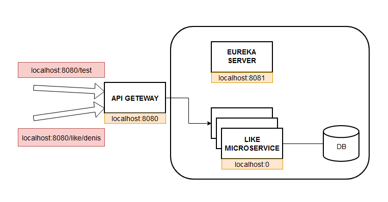

<h1 align="center">Привет, меня зовут Денис</a> 
</h1>

### О проекте ###

Микросервисное веб-приложение для многотопоточного взаимодействия с БД. 

### Архитектура ###



### Проблема ###
Из-за грязного чтения при большом колличестве запросов за одну секунду все запросы сохраняться, в следствии чего данные пользователей потеряются.
Пример: При 1000 одновременных запросов, запишется около 600. Таким образом потеряется 40% данных!

### Решение ###

Необходимо использовать пессимистическую блокировку.

### Использование ###

| Метод  | Описание |
| ------------- | ------------- |
| GET: localhost:8080/test  | Для нагрузочного тестирования. Можно использовать готовый скрипт, в scripts/tests/test_hiload.py  |
| POST: localhost:8080/like/denis  | Для имитирования многопользовательского трафика "лайков на пост" |

### Стек ###

```
Java 11
Spring Boot
Spring Netflix-Eureka Server
Spring Gateway при поддержке Spring WebFlux
Spring MVC
Spring Data JPA
Prometheus и Grafana
PostgreSQL
Lombok
Postman
```
